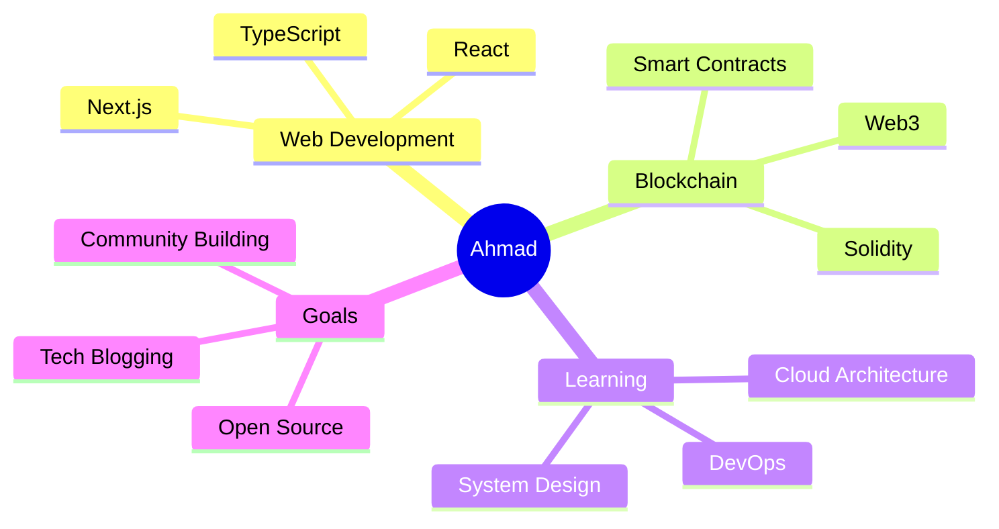

<div align="center">


<h3>Full Stack Developer | Blockchain Enthusiast | Building the Future</h3>


<p align="center">
  <a href="https://www.linkedin.com/in/ahmadparizaad/">
    
  </a>
  <a href="https://x.com/ahmadparizaad">
    
  </a>
  <a href="mailto:mohammadahmad7003@gmail.com">
    
  </a>
  <a href="https://drive.google.com/file/d/14E_RBXqd9N4t7HGAxLgPfknvtuKwoxGG/view">
    
  </a>
</p>


</div>

<br/>

## 🚀 About Me

```typescript
const ahmad = {
    location: "🌍 Working Remotely",
    company: "Varlyq",
    role: "Full Stack Developer",
    focus: ["Next.js", "React", "Node", "Web3"],
    openTo: ["Collaboration", "Freelance", "Open Source"],
    passion: "Building innovative solutions",
    lifePhilosophy: "Code • Learn • Repeat"
};
```

<br/>

<details>
<summary>📊 <b>More About Me (Click to expand)</b></summary>
<br>

- 🔭 Currently building innovative solutions at **[Varlyq](https://www.varlyq.com)**
- 🌱 Deep diving into **Agentic AI**, **Web3**, and **Business Solutions**
- 👯 Open to collaborating on cutting-edge tech projects
- 💬 Ask me about **React**, **Next.js**, **Node.js**, **AI**, **Blockhain**
- ⚡ Fun fact: I turn ideas into reality through code!

</details>

<br/>

## 💻 Tech Stack

<div align="center">

<p>
  
</p>

<p>
  
</p>

<p>
  
</p>

<p>
  
  
  
</p>

<p>
  
</p>

</div>

<br/>

## 📈 GitHub Analytics

<div align="center">
  


</div>

<br/>

<div align="center">
  
[](https://git.io/streak-stats)

</div>

<br/>

<div align="center">

### 🏆 GitHub Achievements

[](https://github.com/ryo-ma/github-profile-trophy)

</div>

<br/>

## 📊 Contribution Activity

<div align="center">


</div>

<br/>

## 🐍 Contribution Snake

<div align="center">

<picture>
  <source media="(prefers-color-scheme: dark)" srcset="https://raw.githubusercontent.com/ahmadparizaad/ahmadparizaad/output/github-contribution-grid-snake-dark.svg">
  <source media="(prefers-color-scheme: light)" srcset="https://raw.githubusercontent.com/ahmadparizaad/ahmadparizaad/output/github-contribution-grid-snake.svg">
  
</picture>

</div>

<br/>

## 💭 Dev Quote

<div align="center">


</div>

<br/>

## 🎯 Current Focus

<div align="center">



</div>

<br/>

<div align="center">

### 💼 Open for Opportunities

I'm always interested in collaborating on innovative projects and exploring new opportunities.

**Let's connect and build something amazing together!**

<br/>


</div>
