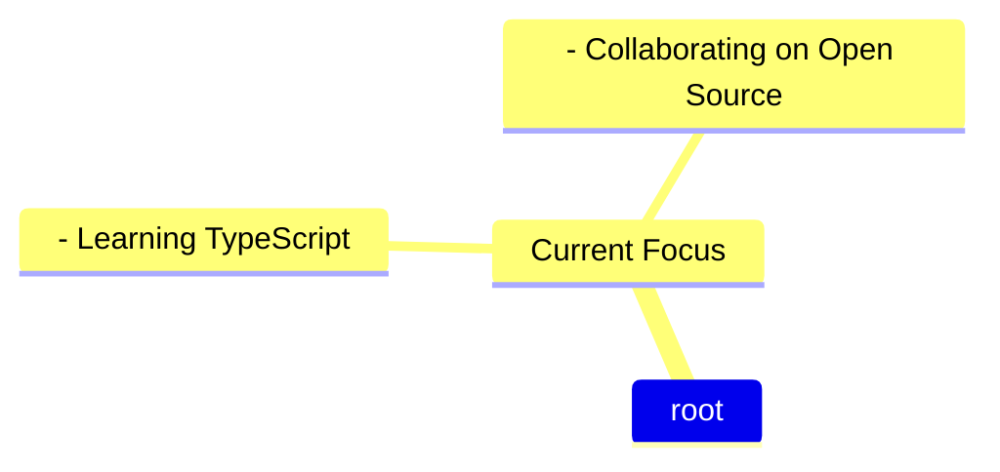

# My Profile

## Animated Header with Typing Animation
<canvas id="animatedHeader"></canvas>

<script>
  const text = 'Welcome to my profile!';
  const typingEffect = (text) => {
    const header = document.getElementById('animatedHeader');
    let index = 0;
    const type = () => {
      if (index < text.length) {
        header.innerHTML += text.charAt(index);
        index++;
        setTimeout(type, 100);
      }
    };
    type();
  };
  typingEffect(text);
</script>

## Social Links
- [LinkedIn](https://www.linkedin.com/in/ahmadparizaad/)
- [Twitter](https://twitter.com/ahmadparizaad)
- [Email](mailto:ahmadparizaad@example.com)
- [Resume](link-to-your-resume)

## About Me (TypeScript)
```typescript
const aboutMe = {
  name: 'Ahmad Parizaad',
  profession: 'Software Developer',
  interests: ['Web Development', 'Open Source', 'AI'],
  bio: 'Passionate about building scalable applications.'
};
```

## More Info (Collapsible Section)
<details>
<summary>Click to see more!</summary>
<p>
Additional Information about my work and projects.
</p>
</details>

## Tech Stack
<div align="center">
  
</div>

## GitHub Stats
<picture>
  <source media="(prefers-color-scheme: dark)" srcset="https://github-readme-stats.vercel.app/api?username=ahmadparizaad&show_icons=true&theme=dark" />
  <source media="(prefers-color-scheme: light)" srcset="https://github-readme-stats.vercel.app/api?username=ahmadparizaad&show_icons=true" />
  
</picture>

## GitHub Streak
<picture>
  <source media="(prefers-color-scheme: dark)" srcset="https://github-readme-streak-stats.herokuapp.com/?user=ahmadparizaad&theme=dark" />
  <source media="(prefers-color-scheme: light)" srcset="https://github-readme-streak-stats.herokuapp.com/?user=ahmadparizaad" />
  
</picture>

## GitHub Trophies
<picture>
  <source media="(prefers-color-scheme: dark)" srcset="https://github-profile-trophy.vercel.app/?username=ahmadparizaad&theme=dark&row=2&column=4" />
  <source media="(prefers-color-scheme: light)" srcset="https://github-profile-trophy.vercel.app/?username=ahmadparizaad&row=2&column=4" />
  
</picture>

## Contribution Activity Graph
<picture>
  <source media="(prefers-color-scheme: dark)" srcset="https://activity-graph.herokuapp.com/graph?username=ahmadparizaad&theme=dark" />
  <source media="(prefers-color-scheme: light)" srcset="https://activity-graph.herokuapp.com/graph?username=ahmadparizaad" />
  
</picture>

## Snake Animation Placeholder
<picture>
  <source media="(prefers-color-scheme: dark)" srcset="https://github.com/ahmadparizaad/ahmadparizaad/blob/output/snake.svg" />
  <source media="(prefers-color-scheme: light)" srcset="https://github.com/ahmadparizaad/ahmadparizaad/blob/output/snake-light.svg" />
  
</picture>

## Dev Quotes
<picture>
  <source media="(prefers-color-scheme: dark)" srcset="https://quotes-github-readme.vercel.app/api?theme=dark" />
  <source media="(prefers-color-scheme: light)" srcset="https://quotes-github-readme.vercel.app/api?theme=light" />
  
</picture>

## Current Focus (Mermaid Mindmap)


## Animated Footer
<footer>Thank you for visiting my profile!</footer>
