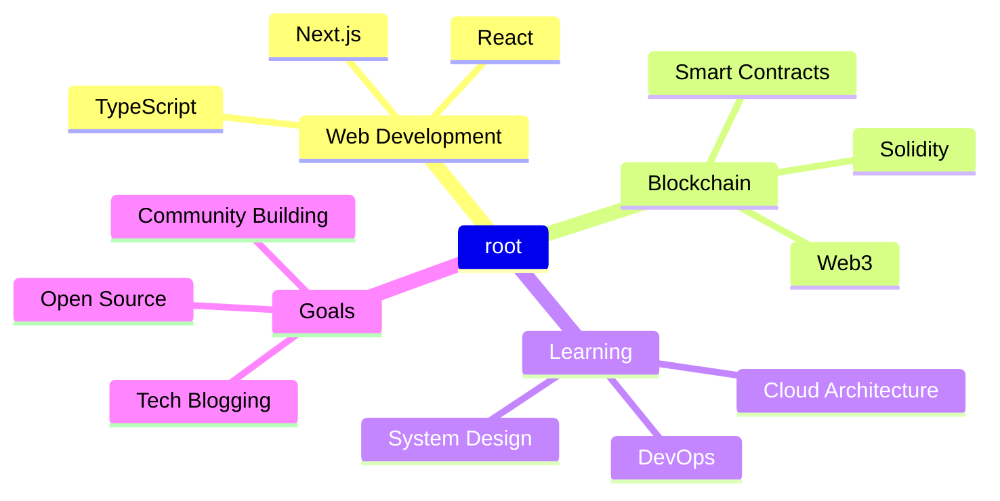

# Optimized GitHub Profile

## Dark Theme Support
This profile supports a dark theme for better visibility and aesthetics.

## GitHub Achievements Trophy Display


## Animated Header


## Typing Animation
```javascript
const typingEffect = () => {
  const text = 'Hello, I am Ahmad!';
  let index = 0;
  const interval = setInterval(() => {
    if (index < text.length) {
      process.stdout.write(text.charAt(index));
      index++;
    } else {
      clearInterval(interval);
    }
  }, 100);
};
typingEffect();
```

## Social Links
- [LinkedIn](https://www.linkedin.com/in/ahmadparizaad/)
- [Twitter](https://x.com/ahmadparizaad)
- [Email Me](mailto:mohammadahmad7003@gmail.com)
- [Resume](https://drive.google.com/file/d/14E_RBXqd9N4t7HGAxLgPfknvtuKwoxGG/view)

## About Me
I work at NapFT, focusing on web and blockchain technologies.

<details>
<summary>More Details</summary>

### Tech Stack
#### Frontend
-  
-  
-  
-  
-  
-  
-  
-  
-  

#### Backend
-  
-  
-  
-  

#### Database
-  
-  
-  
-  
-  

#### Blockchain
-  
-  

#### Tools
-  
-  
-  
-  
-  
-  
-  
-  

## GitHub Stats


## Top Languages Card


## Streak Stats


## GitHub Profile Trophy


## Contribution Activity Graph


## Snake Animation


## Dev Quotes


## Current Focus Areas


## Animated Footer
 

---

*Thank you for visiting my GitHub profile!*